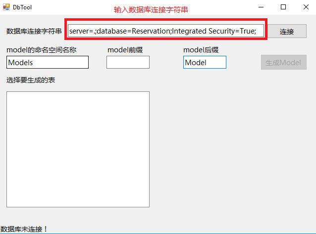
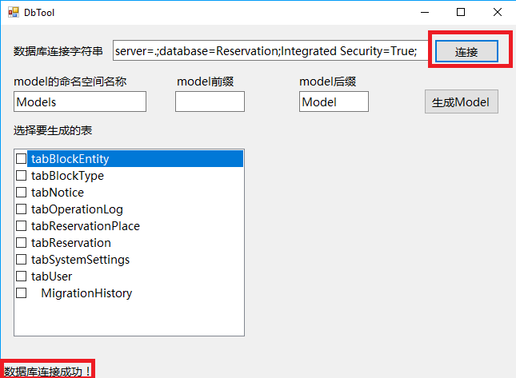
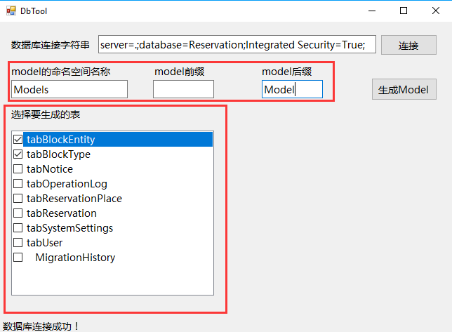
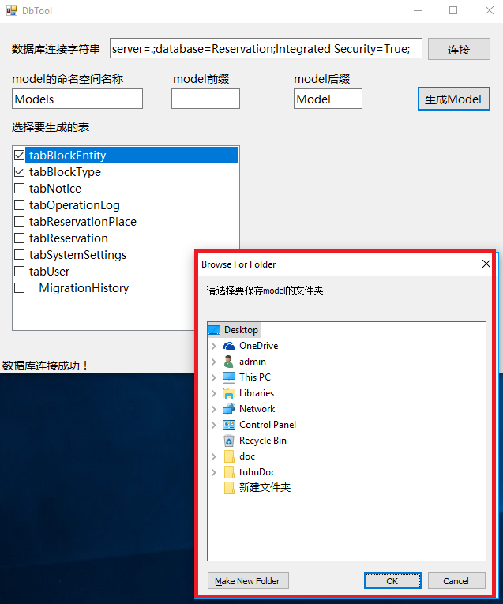
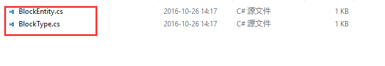

# DbTool
### 简介

这是一个将数据库表生成对应Model的小工具，可以利用这个小工具生成数据库表对应的Model，并且会判断数据表列是否可以为空，可以为空的情况下会使用可空的数据类型，如
int? , DateTime? ，如果数据库中有列描述信息，也会生成在属性名称上添加列描述的注释，支持导出多个表。

**注：不支持外键等需要关联另外一张表的数据关系**

### 为什么使用它

1. 支持数据列可空导出为可空数据类型
2. 支持导出列描述信息
3. 支持一次导出多张数据表
4. 根据表字段信息创建表及Model
5. 导入Excel文件生成创建表的SQL

### 后续功能

1. 根据 Model 生成 sql 语句，根据 Model 注释生成列描述
2. 通过导入Excel文件导入表信息生成Model

### 使用说明

1. 设置自己的连接字符串

    

2. 连接数据库
    
    数据库连接成功之后会在窗体左下角，显示 “数据库连接成功”
    
    

3. 选择要导出 Model 的数据库表，并设置要导出的 Model 的命名空间和前缀与后缀

    Model 和 文件的默认名称是表名称，以“tab”或“tbl”或“tbl_”为前缀的表会先去掉表前缀再取表名称
    默认命名空间是Models（不可为空），默认后缀是 Model （可以为空）
    
    

4. 生成Model

    选择要导出的表并设置Model相关信息后，点击 "生成Model" 按钮，点击按钮之后会弹出一个窗口让你选择保存 Model 文件的目录
    
    

    选择之后会将生成的文件保存到选择的文件夹，并自动打开资源管理器到所选目录
    
    

5. 导入Excel
    
    将数据表信息填到数据模板（[下载模板](https://github.com/WeihanLi/DbTool/raw/master/DbTool/template.xls)）中，选择 ModelFirst Tab 页，点击 “导入Excel” 按钮，选择
    要导入的已填充数据的Excel文件（**不支持 \*.xlsx 文件**），生成成功后会将自动将 sql 语句拷贝到粘贴板中

