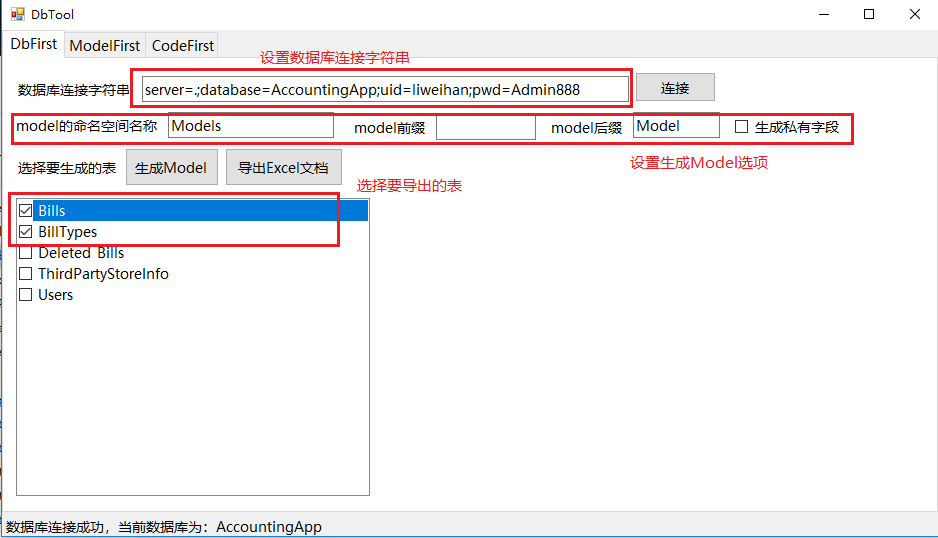
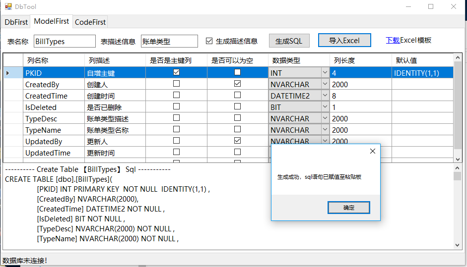
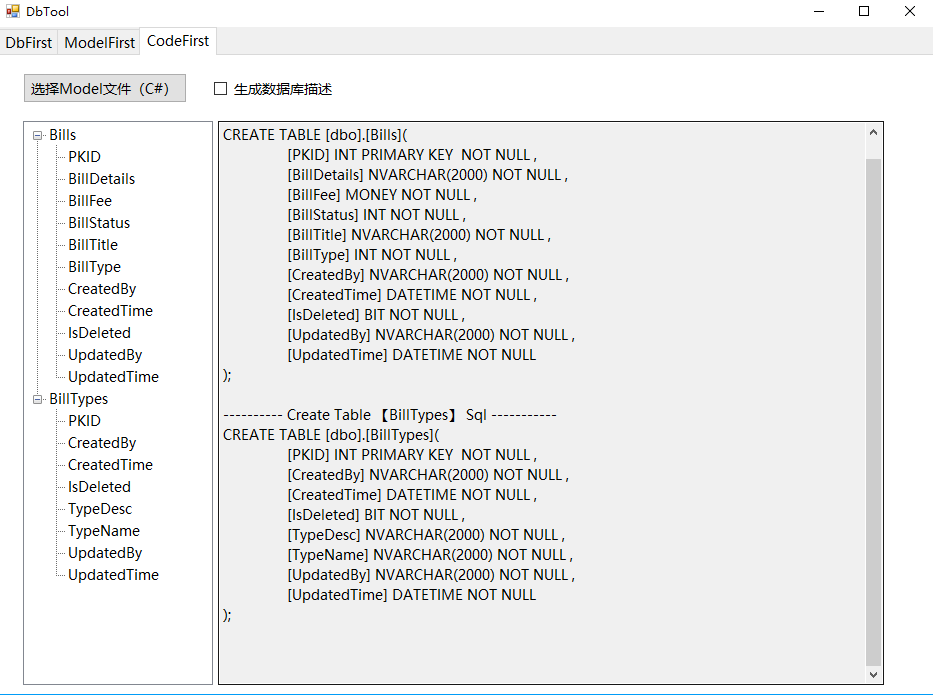
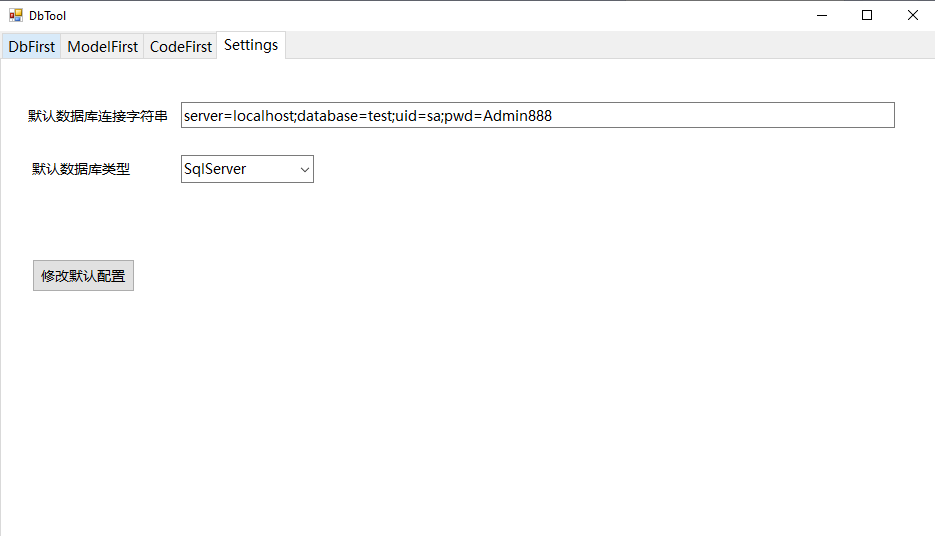

# DbTool

一个支持 DbFirst、ModelFirst 和 CodeFirst 的数据库工具。

[](https://weihanli.visualstudio.com/Pipelines/_build/latest?definitionId=18&branchName=wpf-dev)

[](https://github.com/WeihanLi/DbTool/releases/latest)

## 简介

这是一个针对 `SqlServer` 和 `C#` 的数据库的小工具，可以利用这个小工具生成数据库表对应的 Model，并且会判断数据表列是否可以为空，可以为空的情况下会使用可空的数据类型，如
int? , DateTime? ，如果数据库中有列描述信息，也会生成在属性名称上添加列描述的注释，支持导出多个表；可以导出到Excel，可以根据Excel字段文档生成Sql，数据库表误删除又没有备份的时候就很有帮助了，而且支持反向的根据生成的Model去生成创建数据库表的Sql。

> ### 注：暂时不支持索引及外键等需要关联另外一张表的数据关系

[下载DbTool](https://github.com/WeihanLi/DbTool/releases)

## 为什么使用它

1. [x] 根据表字段信息生成创建表 Sql（Model First）
1. [x] 导入 Excel/Csv 文件生成创建表的 Sql（Model First）
1. [x] 根据数据库表信息生成数据库表 Excel/Csv 文档（Db First）
1. [x] 根据数据库表信息生成 Model 文件，支持数据列可空导出为可空数据类型/支持导出列描述信息（Db First）
1. [x] 根据 Model 生成 sql 语句（Code First）
1. [x] 支持一次导出多张数据表/支持一次选择多个 Model 文件
1. [x] 支持 SqlServer、MySql、PostgreSql

## 扩展开发

- [ ] 丰富插件(插件开发指南：<https://github.com/WeihanLi/DbTool.Packages/blob/main/README.md>)

## 功能一览









## 使用说明

1. DbFirst

    1. 导出数据库表到Model

        1. 设置数据库连接字符串，并连接数据库
        1. 设置导出 Model 选项
        1. 选择要导出 Model 的数据库表
        1. 导出 Model

    > Model 设置选项说明：
    > - model的命名空间：生成的 model 所在的命名空间，默认为 Models，不可为空，为空则使用默认值Models
    > - model前缀：表名的基础上加的前缀，默认为空
    > - model后缀：表名的基础上加的后缀，默认为空
    > - 生成私有字段，默认为 `false`，如果为`false`则使用自动属性的代码风格，反之，使用传统 `get;set;` 风格代码，如：
    > - 全局引用，启用 Global using 和 Implicit Using 特性，默认使用 .NET SDK 包含的引用集合
    > - 可空引用类型，启用可空引用类型，如果数据库列可以为空的字符串，则对应属性会是可为空的字符串 `string?`
    > - 文件范围命名空间，启用文件范围命名空间，如： `namespace Models;`
    >     ``` csharp
    >     public int Id { get; set; } //自动属性风格代码
    >
    >     private int id1;
    >     public int Id1 { get{ return id1; } set { id1 = value; } } //传统get;set风格代码
    >     ```
    > - 生成 Table/Column/Key 信息，生成 DataAnnotation Attribute，默认值为 `true`，如果为`true`则会在属性字段上生成一个`[Description]`的Attribute，如果为false则不生成，效果如下：
    >   ``` csharp
    >   /// <summary>用户名</summary>
    >   [Description("用户名")]
    >   public string UserName { get;set; }
    >   ```
    > - 生成 Model 名称的规则说明：生成的Model的名称由前缀和表名称及后缀拼接而成，如果表名以 `tab`或`tab_`或`tbl`或`tbl_`这些开头，则会先把这些移除掉再拼接，可以通过自定义插件扩展

    1. 导出数据库表到Excel

        1. 设置数据库连接字符串，并连接数据库
        1. 选择要导出到 Excel/Csv 的数据库表
        1. 导出到 Excel/Csv

2. ModelFirst

    1. 可以手动填写信息或者先选择 Excel/Csv 导入
    1. 只生成 Sql 语句，不会自动在数据库里创建表，根据生成的 Sql 语句再创建表

3. CodeFirst

    1. 根据已有的 Model 生成创建表的 sql ，字段注释会从属性的 `Description` Attribute 中获取
    1. 根据需要设置是否生成数据库描述 sql
    1. 左侧生成表字段信息，右侧生成创建表的sql，生成的 Sql 仅供参考，请自行根据需要调整数据类型以及字段长度

4. Settings

    1. 修改默认数据库连接字符串
    1. 修改默认数据库类型
    1. 修改默认语言
    1. 修改默认全局引用配置
    1. 修改默认可空引用类型配置
    1. 修改默认文件范围命名空间配置

## Contact Me

如果你遇到了什么问题，欢迎联系我 <weihanli@outlook.com>

或者在这里[提出问题](https://github.com/WeihanLi/DbTool/issues/new)
